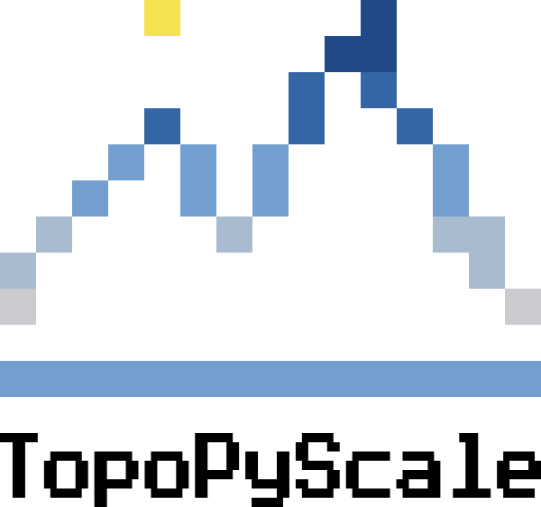

# Welcome to TopoPyScale Documentation


<figure markdown>
  { width="250" }
</figure>

TopoPyScale is a downscaling toolbox for global and regional climate model datasets, particularly relevant to mountain ranges, and hillslopes. 

- **Source Code Github Repository**: [https://github.com/ArcticSnow/TopoPyScale](https://github.com/ArcticSnow/TopoPyScale)
- **Examples Repository**: [https://github.com/ArcticSnow/TopoPyScale_examples](https://github.com/ArcticSnow/TopoPyScale_examples)
- **Documentation Repository**: h[ttps://github.com/ArcticSnow/TopoPyScale_Documentation](ttps://github.com/ArcticSnow/TopoPyScale_Documentation)

If you are here to use TopoPyScale, then head to the [Quick Start](./2_quickstart.md) page. Further configuration setup are explained in detail

## General Concept

TopoPyScale uses both climate model data and Digital Elevation Models (DEM) for correcting atmospheric state variables (e.g. temperature, pressure, humidity, *etc*). TopoPyScale provides tools to interpolate and correct such variables to be relevant locally given a topographical context. 

The most basic requirements of TopoPyscale is a DEM used to defined the spatial domain of interest as well as compute a number of morphometrics, and configuration file defining the temporal period, the downscaling methods and other parameters. In its current version, TopoPyScale includes the `topoclass` class that wraps all functionalities for ease of use. It automatically fetches data from the [ERA5](https://cds.climate.copernicus.eu/cdsapp#!/dataset/reanalysis-era5-pressure-levels?tab=overview) repositories (Pressure and Surface levels). Other climate data sources can be added. Based on the high resolution (30-100m) DEM and the climate data, methods in the `topoclass` will compute, correct and interpolate variables need to force specialized land-surface models.

TopoPyScale includes a number of export format inter-operable with specialized energy and mass balance land surface models like [CRYOGRID](https://github.com/CryoGrid/CryoGridCommunity_source), [CROCUS](http://bibliotheque.meteo.fr/exl-php/cadcgp.php?CMD=CHERCHE&MODELE=vues/mf_-_internet_recherche_avancee_anonyme/tpl-r.html&WHERE_IS_DOC_REF_LIT=DOC00019133&&TABLE=ILS_DOC), [SNOWPACK](https://www.slf.ch/en/services-and-products/snowpack.html), [FSM](https://github.com/RichardEssery/FSM), [Snowmodel](https://srs.fs.usda.gov/pubs/26319), [GEOTOP](http://geotopmodel.github.io/geotop/) or [MuSa](https://github.com/ealonsogzl/MuSA).

Downscaled variable includes:

- 2m air temperature
- 2m air humidity
- 2m air pressure
- 10m wind speed and direction
- Surface shortwave incoming radiation
- Surface longwave incoming radiation
- Precipitation (possibility to partition snow and rain)

(insert sketches and diagram to illustrate the principle)

## Quick Installation

### Release Installation
To install the latest release, in a virtual environment simply use `pip`

```bash
pip install topopyscale
```

As of now, TopoPyScale uses the Copernicus `cdsapi` to download data. For this to work, you will need to setup the Copernicus API key in your system. Follow [this tutorial](https://cds.climate.copernicus.eu/api-how-to#install-the-cds-api-key) after creating an account with Copernicus. 

On Linux, create a file nano ~/.cdsapirc with inside:
```text
url: https://cds.climate.copernicus.eu/api/v2
key: {uid}:{api-key}
```


## Funding and Support

TopoPyScale is currently developed by scientists at:

- [University of Oslo](https://www.mn.uio.no/geo/english/), Norway
- SLF, Switzerland